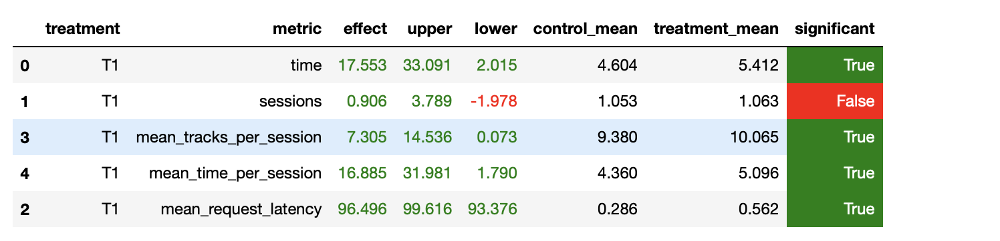

# Собственный Recommender

## Идея
Сделать postprocessing Нейросетевого рекоммендатора с семинара, добавить некоторый аналог ансамбля + учитывать уже прослушенные треки(добавить online info)

## Детали
В процессе работы были сделаны следующие действия над Нейросетевого рекоммендатором
1. Вместо того, чтобы рекоммендовать случайный трек из составленных имеет смысл реккомендовать чаще тех у кого time больше. Для этого в базе теперь храняться не только track - recommendations, а также веса(предсказанное время прослушивание нейросетью)
```
predict = np.dot(track_embeddings, embedding)
weights = predict[neighbours].tolist()
weights = F.softmax(torch.tensor(weights), dim=0)
```
2. Также были удалены треки который нейросетевой рекоммендатор предлагал, но ожидаемое время прослушивания было меньше порога(0.5). Вместо это рекоммендации добавлялись самыми популярными треками данного исполнителя или просто самыми популярными песнями. Таким образом количество рекоммендация и соответствущих весов для каждого трека стало от 30 до 70.
```
if len(neighbours) == 0:
    neighbours = list(df[df.index.get_level_values('artist') == track['artist']].index.get_level_values('track'))
    weights = list(df[df.index.get_level_values('artist') == track['artist']].values)
if len(neighbours) < k_top_song:
    additional_songs = track_popularity.sample(k_top_song - len(neighbours))
    neighbours.extend(list(additional_songs['track']))
    if len(weights) > 0:
        additional_weights = [min(weights) / 3] * len(additional_songs)
    else:
        additional_weights = list(additional_songs['time'])
    weights.extend(additional_weights)
```
3. Т.к. теперь у нас некоторые треки рекоммендуются чаще, то необходимо хранить пользовательскую сессию и удалять из рекоммендаций уже прослушенные треки.
```
self.tracks_redis_listened.set(user, self.catalog.to_bytes({'listened': listened, 'last_recommender': 'tracks_redis'}))
```
4. Также был добавлен персональный рекоммендатор на случай если нейросетевой начинает плохо справляться. Таким образом если время прослушивания трека, который рекоммендовал нейросетевой рекоммендатор, меньше порога(0.7), то мы начинаем рекоммендовать на основе персонального рекоммендатора, до тех пор, пока персональный рекоммендатор превышает порог
```
if prev_track_time < 0.7 and prev_recommender == 'tracks_redis' or prev_track_time >= 0.7 and prev_recommender == 'recommendations_redis':
    track = self.recommendations_redis.recommend_next(user, prev_track, prev_track_time)
```

## Результаты


Мой подход не слишком сильно улучшил результат, я бы даже сказал прошел со скрипом. Имплементация шагов 1 и 4 дала наибольший прирост.

## Запуск
Также как на семинаре, только с использованием python 3.9. У меня mac на m1 и не получалось подружить scipy и numpy.
